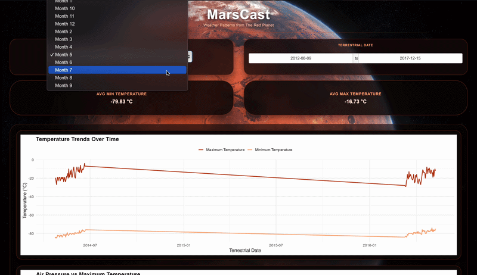

# MarsCast 🪐

MarsCast is an individual **Shiny for R** reimplementation of our original Mars weather dashboard project.  
It explores historical Martian weather data collected by NASA's *Curiosity Rover* and provides an interactive interface for filtering and visualizing temperature and pressure patterns on Mars.

## Deployed App

- Deployed Dashboard: 

---

## Demo



## Overview

This repository contains a simplified Mars weather dashboard built in **Shiny for R**.  
The app is based on the original group project, which was implemented in **Shiny for Python**, but this version was rebuilt individually in R to practice reactive programming and dashboard development in a different language.

The dashboard supports interactive filtering and updates key outputs automatically based on user selections.

1. **Monitoring Current Conditions**  
   Track temperature and seasonal patterns to approximate present-day Martian weather.

2. **Mission Planning**  
   Identify safer windows in the Martian year for landing and surface operations.

3. **Climate Trends Over Time**  
   Analyze long-term changes and recurring seasonal behavior across multiple sols.

4. **Engineering Constraints**  
   Understand extreme conditions that future rovers must endure, informing design and testing requirements.

---

## Data Description

### Dataset

The dataset contains weather observations from **Sol 1 (August 7, 2012 on Earth)** to **Sol 1895 (February 27, 2018 on Earth)**, measured directly on the surface of Mars.

### Source

- Collected by the **Rover Environmental Monitoring Station (REMS)**
- On-board the **Curiosity Rover**
- Publicly released by:
  - NASA’s Mars Science Laboratory
  - Centro de Astrobiología (CSIC-INTA)

More information about the source data is available here:  
<https://github.com/the-pudding/data/tree/master/mars-weather>

---

## Tools & Technologies

This project uses:

- **R**
- **Shiny** for interactive dashboard development
- **dplyr** for data wrangling
- **ggplot2** for plotting
- **readr** for reading the dataset

---

## Dashboard Features

This app includes:

- **Martian month filtering** to explore weather patterns for a selected month
- **Terrestrial date range filtering** to focus on a specific observation window
- **Reactive KPI outputs** for:
  - average minimum temperature
  - average maximum temperature
- **Temperature trend visualization** over time
- **Scatter plot** showing the relationship between air pressure and maximum temperature

---

## Target Audience

This project is intended for:

- Astronauts and mission planners  
- Aerospace engineers  
- Planetary scientists  
- Space data analysts  

The dashboard prioritizes **clarity, interpretability, and operational relevance** over purely academic analysis.

---

## Project Structure

```text
├── README.md
├── app.R
├── data/
│   └── mars-weather.csv
├── LICENSE
└── www/
    └── mars_bg.png
```

## For Contributors

## Getting Started

### Prerequisites

Make sure you have R installed on your machine.

**1. Clone the repository**

```bash
git clone https://github.com/zainnofal/MarsCast-R.git
cd MarsCast-R
```

**2. Install required packages**

Open R and run:

```R
install.packages(c("shiny", "dplyr", "ggplot2", "readr"))
```

**3. Run the application**

From the repository root, run:

```R
shiny::runApp()
```

## Acknowledgements

- NASA’s Mars Science Laboratory
- Centro de Astrobiología (CSIC-INTA)
- The Curiosity Rover team

Their work makes planetary-scale data science possible.

## License

This project is released under an open-source license. See [LICENSE](LICENSE) for details.